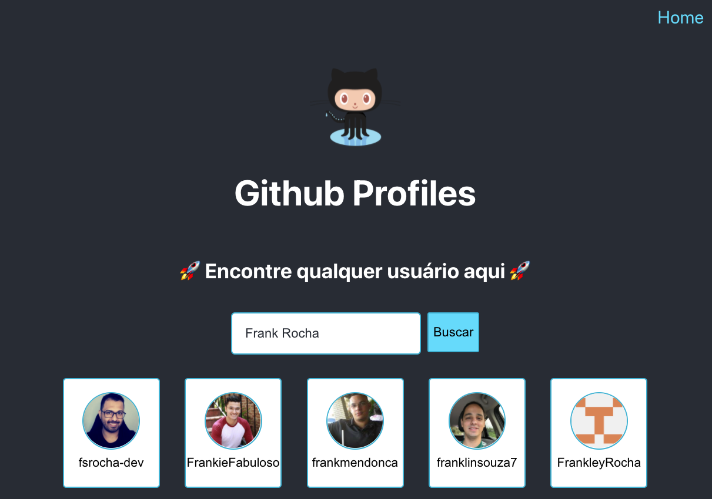

# Gabarito de aplicação

Mini projetinho criado por min, para execução das pessoas estudantes na Trybe.

Tecnologias utilizadas:
- React
- Redux
- Redux Thunk
- Styled Components

## Como rodar

Clonar repositório, entrar dentro da pasta e executar:

### `npm install`
### `npm start`

## Preview

    

